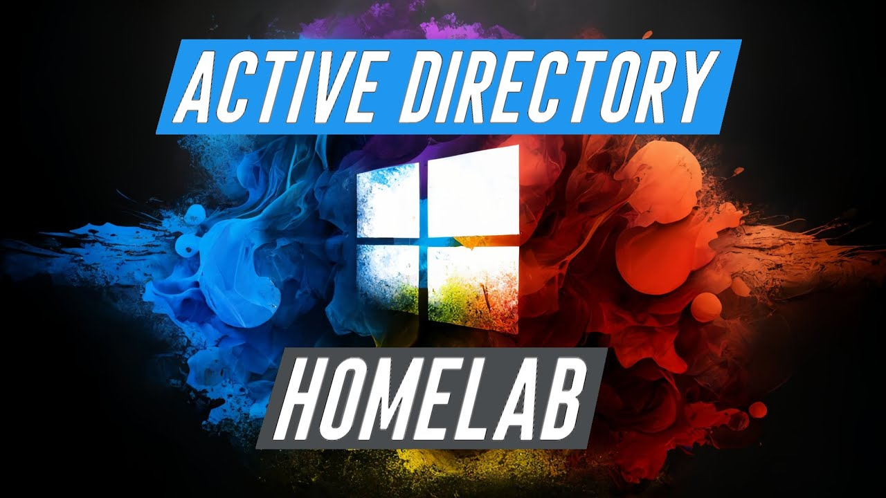
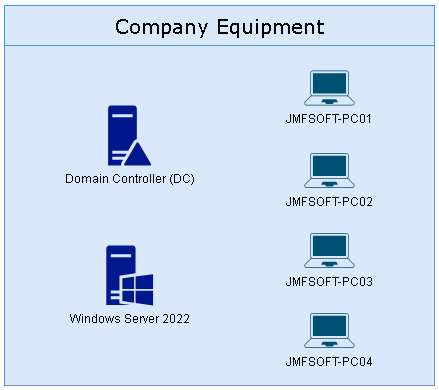
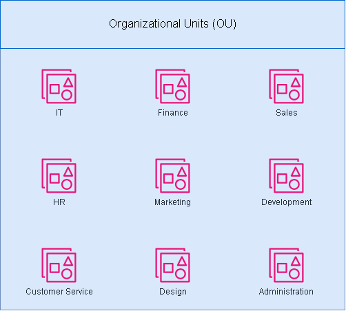
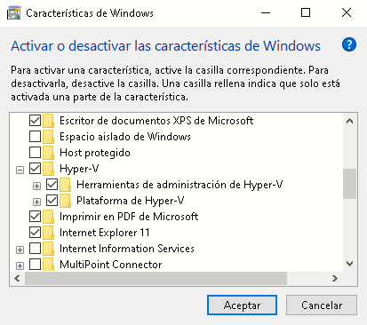
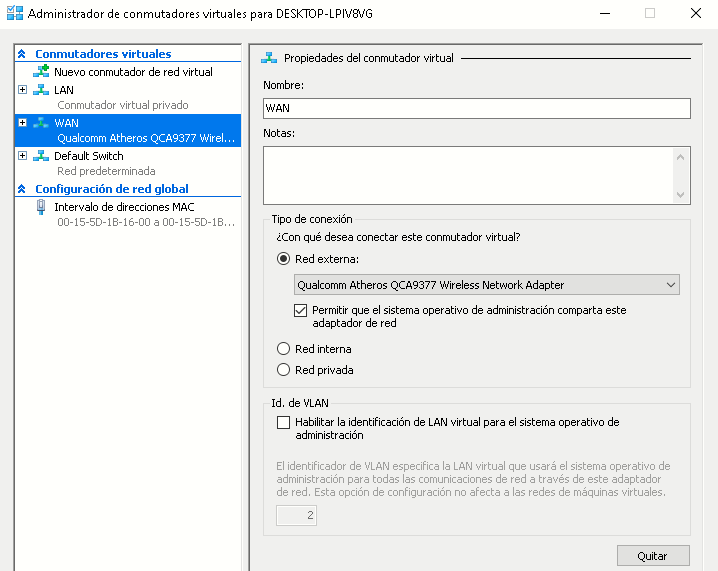

# Active Directory Home Lab - Personal Project

Welcome to my personal project of creating a homelab utilizing Active Directory, both on-premises and in the cloud with Azure Active Directory. This project showcases the step-by-step creation of the homelab, including skills acquired such as user and group creation, password resets, and various other administrative tasks.

-----------------------------------------------------------------------------------------------------

# Table of Contents

1. [Homelab Creation](#homelab-creation)
2. [User and Group Creation](#user-and-group-creation)
3. [Password Reset](#password-reset)

-----------------------------------------------------------------------------------------------------

## Homelab Creation

In this homelab setup, we will be using Hyper-V to create a virtualized environment. The primary components of this setup will include:

1. **Two Servers**:
    - One server will act as the **Domain Controller (DC)**, responsible for managing the Active Directory (AD) and handling authentication and authorization within the domain.
    - The second server will be used for other purposes such as file storage, applications, or additional services required within the network.

2. **Four Client Machines**:
    - These machines will be used to simulate end-user workstations within the network. Each machine will be joined to the domain controlled by the Domain Controller.
  
    - Naming Convention
        - Prefix: JMFSOFT
        - Client Identifier: PC
        - Unique Number: 01, 02, 03, 04

        Detailed Naming List:
        1. JMFSOFT-PC01
        2. JMFSOFT-PC02
        3. JMFSOFT-PC03
        4. JMFSOFT-PC04

### Organizational Units (OUs) for Departments

To keep our domain structure well-organized, we will create Organizational Units (OUs) for each department. This will help us manage users, computers, and other resources efficiently within Active Directory. The following OUs will be created:

1. **IT** - Contains users such as IT Support, Sysadmins, and Network Engineers.
2. **Finance** - Contains users such as Finance Managers and Finance Analysts.
3. **Sales** - Contains Sales Representatives.
4. **HR** - Contains the HR Manager and related personnel.
5. **Marketing** - Contains Marketing Specialists and Content Writers.
6. **Development** - Contains Developers and DevOps Engineers.
7. **Customer Service** - Contains Customer Service Representatives.
8. **Design** - Contains Graphic Designers.
9. **Administration** - Contains the Office Manager and administrative staff.

### Summary of Steps

| Step | Description |
|------|-------------|
| **1. Set up Hyper-V on your host machine** |   |
|     1.1 | **Install Hyper-V**: Open the Control Panel, navigate to Programs > Programs and Features > Turn Windows features on or off, check the box for Hyper-V, click OK, and restart your computer.     |
|     1.2 | **Configure Hyper-V**: Open Hyper-V Manager from the Start menu, select your host machine, and configure virtual switches by going to Virtual Switch Manager in the right-hand Actions menu. Create a new External virtual switch to allow VMs to access your physical network.    |
| **2. Create Virtual Machines** |   |
|     2.1 | **Create the Domain Controller VM**: In Hyper-V Manager, click New > Virtual Machine, and follow the wizard to set up the VM with appropriate settings such as name, generation, memory, network, and virtual hard disk. Install an operating system later.   In my case, I'm going to choose to change the default path to store the virtual machine, as it seems more organized to me. In this case, I'll opt to place it in C:\Hyper-V\VMs\\.        Afterwards, I select Generation 1, as Generation 2 can be prone to errors.        Now, I need to allocate the RAM to the virtual machine. In this case, I'll opt for the minimum recommended for Windows Server 2022 with Desktop Experience, which is 4GB (4096 MB).   Additionally, I'll choose to leave the **'Use dynamic memory for this virtual machine'** checkbox checked.   When a virtual machine uses dynamic memory, it means that its memory allocation can adjust automatically based on the demand from the operating system and applications running within the virtual machine. Instead of assigning a fixed amount of memory, the virtual machine can request and release memory as needed, allowing for more efficient utilization of host resources.        Then, I select the network adapter to which the virtual machine will connect. In this case, it's the network adapter created in step 1.2 (WAN), which is associated with my Qualcomm Atheros QCA9377 wireless network card.        Next, I will create a virtual hard disk of 2TB (2048GB), which will be more than enough for any practice you may want to perform.        Finally, I select the option 'Install an operating system from a bootable CD/DVD-ROM' and locate the location of the .ISO file containing the Windows Server 2022 Operating System.        Once this is done, the virtual machine is successfully created. Now, all that's left is to connect to it, start it up, and follow the Windows Server installer.        |
|     2.2 | **Create the Second Server VM**: Follow the same steps as above but name this VM Server2.    Next, I create the second virtual machine, which will also have Windows Server 2022 as its operating system. I will avoid detailing the installation as it is the same as the DC01 virtual machine, only the name is different.   In this case, the virtual machine will be named 'SV02'.        Then, once all the fields are filled out, I have the 2 server machines created.        |
|     2.3 | **Create the Client VMs**: Repeat the VM creation process four times for client machines, naming them JMFSOFT-PC01, JMFSOFT-PC02, JMFSOFT-PC03, and JMFSOFT-PC04. Assign at least 1024 MB of memory to each client VM.    Now, I repeat the process but instead of using the Windows Server 2022 .iso file as the boot disk, I choose the Windows 10 .iso file.            Then, once the 2 servers (Windows Server 2022) and the four client machines (Windows 10) are created, I have the following: |
| **3. Install the necessary operating systems on all VMs** |   |
|     3.1 | **Prepare installation media**: Obtain ISO files for Windows Server (for the servers) and Windows 10/11 (for the client machines).    In this case, I chose to download both .iso files (Windows Server 2022 and Windows 10) beforehand, but you can also choose the option 'Install an operating system later,' which creates the virtual machine and waits for you to attach the desired .iso file later.    If you prefer to do it that way, you can download the .iso files from the official Microsoft website:    -  [Windows Server 2022](https://www.microsoft.com/es-ES/evalcenter/evaluate-windows-server-2022)  -  [Windows 10](https://www.microsoft.com/es-es/software-download/windows10)   |
|     3.2 | **Install Windows Server on DC1 and Server2**: Start the VM, connect to it, attach the Windows Server ISO, and follow the installation prompts to install Windows Server. Configure the server with appropriate settings (e.g., server name, IP address).    Once the virtual machine is created and the Windows Server 2022 disk is 'inserted,' I will start it and proceed with the installation. I will perform this process for both the DC01 (Domain Controller) server and the SV02 server.        After clicking 'Install,' I need to select the version I want. Among the options are the Standard and Datacenter versions, each with a Desktop Experience (GUI) version and a Server Core version. In this case, I will select the Standard version with Desktop Experience:        Next, I need to select the partition on which the operating system will be installed. In this case, it is the only partition I have: the 2TB partition created when I created the virtual machine, but I could also create another partition and install it there.        After selecting the partition, the installer will continue copying files and installing the operating system. The installation time varies depending on the resources, both those we have and those allocated to the virtual machine.        Now, once the above is completed, you will be prompted to create a password for the 'Administrator' user, who has full control over the operating system. This account is similar to the superuser in Linux. It is essential to remember this password.        Now, I can log in with the credentials provided recently.        Once logged in, the 'Server Manager' will automatically open (this can be disabled), which allows managing Roles and Features, configuring the server's Firewall, changing the name, changing the IP address, managing storage, etc.    In this case, within the 'Local Server' section, I will change its name and IP address. The IP address will change from being managed by DHCP to static, which is seen as a good practice (in servers, not in client machines), as it increases reliability among other reasons.         The **name** will be: DC01.        The **static IP address** for DC01 will be: 192.168.1.5   The **subnet mask** will be: 255.255.255.0, which means that the first 3 octets of the IP address (192.168.1) will correspond to identifying the network portion, while the fourth and last octet will correspond to identifying the host portion. In this case, with the /24 subnet mask, we get 2^8 - 2 (254) available hosts for the devices and/or servers (2 raised to the available bits, minus 2 because there are 2 addresses that cannot be assigned: 192.168.1.0, which corresponds to the network address, and 192.168.1.255, which corresponds to the broadcast address).   The **default gateway** will be 192.168.1.1, corresponding to the IP address of the default gateway that I have.   The **primary DNS server** will be: 8.8.8.8, corresponding to Google's public DNS server.   **The alternate DNS server** will be: 8.8.4.4, also corresponding to another public DNS server provided by Google.        To apply the changes (the server name change), it is necessary to restart the computer.    That's all for the DC01 server (temporarily, although it's still not a domain controller). Now, I will proceed to install the Windows Server operating system on the other server machine (SV02). |
|     3.3 | Install Windows 10/11 on client VMs: Start each client VM, connect to it, attach the Windows 10/11 ISO, and follow the installation prompts to install Windows. Configure each client with appropriate settings (e.g., machine name, IP address). |
| **4. Configure the Domain Controller** |   |
|     4.1 | Install Active Directory Domain Services (AD DS): Log in to DC1, open Server Manager, click Add roles and features, select Active Directory Domain Services, and complete the installation. |
|     4.2 | Promote DC1 to a Domain Controller: After installation, click on the notification flag in Server Manager, select Promote this server to a domain controller, choose Add a new forest, enter a root domain name (e.g., jmsoft.local), and complete the wizard. Restart the server as prompted. |
| **5. Join all client machines to the domain** |   |
|     5.1 | Configure network settings: Ensure that all client machines and the second server can resolve the domain by setting the DNS server to the IP address of DC1. |
|     5.2 | Join each client to the domain: On each client machine, open System Properties (right-click on This PC > Properties > Advanced system settings), click on Change next to To rename this computer or change its domain or workgroup, select Domain, enter the domain name (e.g., jmsoft.local), provide the credentials of a domain user, and restart each client machine after joining the domain. |
| **6. Create Organizational Units (OUs) in Active Directory for each department** |   |
|     6.1 | Open Active Directory Users and Computers (ADUC) on DC1: Go to Server Manager > Tools > Active Directory Users and Computers. |
|     6.2 | Create OUs: Right-click on the domain (e.g., jmsoft.local) and select New > Organizational Unit. Create OUs for each department (e.g., IT, Finance, Sales, HR, Marketing, Development, Customer Service, Design, Administration). |
|     6.3 | Move user accounts to OUs: After creating user accounts, move each account to the appropriate OU by right-clicking on the user, selecting Move, and choosing the appropriate OU. |

## User and Group Creation

### User Accounts and Domain Access

Although we are creating only four virtual machines to simulate end-user workstations, we will create 20 distinct user accounts within Active Directory. This approach avoids the unnecessary complexity and resource consumption of creating 20 separate machines, while still allowing us to manage and test all 20 user accounts effectively. Each user will be able to log into any of the four client machines and access the domain as if they were on a unique machine.

### User List

1. **Juan Martín Franco**
   - **Username:** juanma
   - **Occupation:** IT Support
   - **Email:** juanmafranco@jmfsoft.com
   - **Phone:** 2325 65 1813
   - **Department:** IT
   - **Location:** Argentina

2. **Bob Smith**
   - **Username:** bsmith
   - **Occupation:** Sysadmin
   - **Email:** bob.smith@jmfsoft.com
   - **Phone:** (555) 123-4562
   - **Department:** IT
   - **Location:** San Francisco

3. **Carol Davis**
   - **Username:** cdavis
   - **Occupation:** Finance Manager
   - **Email:** carol.davis@jmfsoft.com
   - **Phone:** (555) 123-4563
   - **Department:** Finance
   - **Location:** Chicago

4. **David Brown**
   - **Username:** dbrown
   - **Occupation:** Sales Representative
   - **Email:** david.brown@jmfsoft.com
   - **Phone:** (555) 123-4564
   - **Department:** Sales
   - **Location:** Miami

5. **Eve Miller**
   - **Username:** emiller
   - **Occupation:** HR Manager
   - **Email:** eve.miller@jmfsoft.com
   - **Phone:** (555) 123-4565
   - **Department:** HR
   - **Location:** Los Angeles

6. **Frank Wilson**
   - **Username:** fwilson
   - **Occupation:** IT Support
   - **Email:** frank.wilson@jmfsoft.com
   - **Phone:** (555) 123-4566
   - **Department:** IT
   - **Location:** New York

7. **Grace Moore**
   - **Username:** gmoore
   - **Occupation:** Marketing Specialist
   - **Email:** grace.moore@jmfsoft.com
   - **Phone:** (555) 123-4567
   - **Department:** Marketing
   - **Location:** Boston

8. **Hank Taylor**
   - **Username:** htaylor
   - **Occupation:** Developer
   - **Email:** hank.taylor@jmfsoft.com
   - **Phone:** (555) 123-4568
   - **Department:** Development
   - **Location:** San Francisco

9. **Ivy Anderson**
   - **Username:** ianderson
   - **Occupation:** Product Manager
   - **Email:** ivy.anderson@jmfsoft.com
   - **Phone:** (555) 123-4569
   - **Department:** Product
   - **Location:** Seattle

10. **Jack Thomas**
    - **Username:** jthomas
    - **Occupation:** Sysadmin
    - **Email:** jack.thomas@jmfsoft.com
    - **Phone:** (555) 123-4570
    - **Department:** IT
    - **Location:** San Francisco

11. **Kathy White**
    - **Username:** kwhite
    - **Occupation:** Customer Service Representative
    - **Email:** kathy.white@jmfsoft.com
    - **Phone:** (555) 123-4571
    - **Department:** Customer Service
    - **Location:** Houston

12. **Leo Harris**
    - **Username:** lharris
    - **Occupation:** Network Engineer
    - **Email:** leo.harris@jmfsoft.com
    - **Phone:** (555) 123-4572
    - **Department:** IT
    - **Location:** New York

13. **Mona Martin**
    - **Username:** mmartin
    - **Occupation:** Content Writer
    - **Email:** mona.martin@jmfsoft.com
    - **Phone:** (555) 123-4573
    - **Department:** Marketing
    - **Location:** Boston

14. **Nate Jackson**
    - **Username:** njackson
    - **Occupation:** Database Administrator
    - **Email:** nate.jackson@jmfsoft.com
    - **Phone:** (555) 123-4574
    - **Department:** IT
    - **Location:** Chicago

15. **Lara Vega**
    - **Username:** laravega
    - **Occupation:** Graphic Designer
    - **Email:** laravega@jmfsoft.com
    - **Phone:** (555) 123-4575
    - **Department:** Design
    - **Location:** Argentina

16. **Paul King**
    - **Username:** pking
    - **Occupation:** IT Support
    - **Email:** paul.king@jmfsoft.com
    - **Phone:** (555) 123-4576
    - **Department:** IT
    - **Location:** New York

17. **Quinn Scott**
    - **Username:** qscott
    - **Occupation:** Sales Representative
    - **Email:** quinn.scott@jmfsoft.com
    - **Phone:** (555) 123-4577
    - **Department:** Sales
    - **Location:** Miami

18. **Rachel Adams**
    - **Username:** radams
    - **Occupation:** Finance Analyst
    - **Email:** rachel.adams@jmfsoft.com
    - **Phone:** (555) 123-4578
    - **Department:** Finance
    - **Location:** Chicago

19. **Sam Turner**
    - **Username:** sturner
    - **Occupation:** DevOps Engineer
    - **Email:** sam.turner@jmfsoft.com
    - **Phone:** (555) 123-4579
    - **Department:** IT
    - **Location:** Seattle

20. **Tina Phillips**
    - **Username:** tphillips
    - **Occupation:** Office Manager
    - **Email:** tina.phillips@jmfsoft.com
    - **Phone:** (555) 123-4580
    - **Department:** Administration
    - **Location:** Los Angeles

## Password Reset
Content for password reset...
